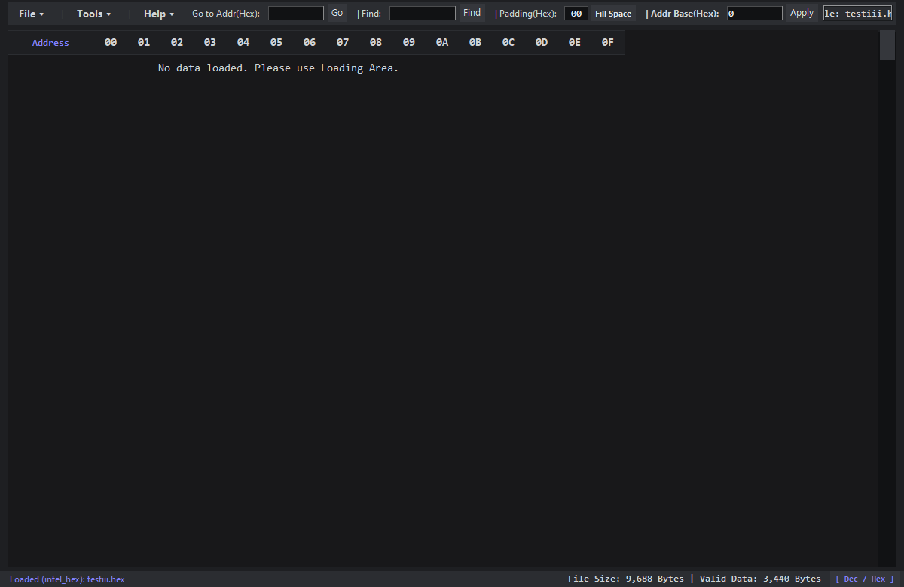

# Meta Hex Editor (v1.2)

[](https://github.com/metacity9/Metahex/actions)
[](https://opensource.org/licenses/MIT)

**Meta Hex Editor**는 Python과 Tkinter로 구현된 고성능 가상 스크롤(Virtual Scrolling) 기반의 헥사 에디터(Hex Editor)입니다. 메모리 사용을 최소화하여 대용량 파일도 렉 없이 즉시 열고 탐색할 수 있는 가벼운 데스크톱 애플리케이션입니다.

---

## 🚀 다운로드 및 실행 링크

설치 없이 바로 실행할 수 있는 버전과 파이썬 코드를 제공합니다.

| 플랫폼 | 구분 | 다운로드 링크 | 실행 방법 |
|:---:|:---:|:---:|---|
| **Windows** | 실행 파일 (`.exe`) | [📥 Windows 다운로드](https://github.com/metacity9/Metahex/releases/latest/download/HexEditor-windows.exe) | 다운로드 후 `HexEditor-windows.exe` 더블 클릭 실행 |
| **Linux** | 실행 파일 (바이너리) | [📥 Linux 다운로드](https://github.com/metacity9/Metahex/releases/latest/download/HexEditor-linux) | `chmod +x HexEditor-linux` 실행 권한 부여 후 터미널에서 `./HexEditor-linux` 실행 |
| **Python Source** | 파이썬 코드 (`.py`) | [📥 HexEditor.py 다운로드](https://github.com/metacity9/Metahex/releases/latest/download/HexEditor.py) | Python 3.x 설치 후 터미널에서 `python HexEditor.py` 실행 |

> 💡 **참고**: 최신 빌드와 이전 릴리즈 목록은 [GitHub Releases 페이지](https://github.com/metacity9/Metahex/releases)에서 확인하실 수 있습니다.

---

## 📸 실행 화면 및 데모

### 1. 실행 스크린샷 (Screenshot)


### 2. 가상 스크롤 기능 데모 (GIF)


---

## ✨ 핵심 기능

1. **초고성능 가상 스크롤 (Virtual Scrolling)**
   - 대용량 바이너리 파일을 불러와도 화면에 보이는 만큼만 렌더링하므로 지연 시간이 없고 스크롤이 매우 부드럽습니다.
2. **간편한 인라인 편집 (Inline Editing)**
   - 편집하고자 하는 헥사 그리드 셀을 **더블 클릭**하여 Hex 값을 직접 타이핑하고 즉시 반영할 수 있습니다.
3. **주소 시작 오프셋 설정 (Address Base Offset)**
   - 로드된 데이터의 가상 주소 시작 오프셋을 원하는 주소값(예: `0x1000`)으로 변경하여 실제 하드웨어 맵핑 주소와 매칭해서 볼 수 있습니다.
4. **빈 영역 패딩 채우기 (Padding/Fill Space)**
   - 비어있는 데이터 주소 영역을 사용자가 정의한 바이트(예: `00` 혹은 `FF`)로 일괄 채워넣을 수 있습니다.
5. **북마크 및 이동 프리셋 (Location Presets)**
   - 분석 중 자주 방문하는 주소(Offset)를 이름과 함께 북마크(Preset)로 저장해두고, 더블 클릭으로 해당 주소로 즉시 점프할 수 있습니다. 북마크 목록은 JSON 파일로 내보내거나 가져올 수 있습니다.
6. **데이터 무결성 검증 (Data Verification / CRC)**
   - 데이터 범위에 대해 CRC8, CRC16, CRC32, 체크섬(Checksum) 등의 검증용 해시 값을 즉석에서 계산해 주는 도구를 제공합니다.
7. **다양한 파일 형식 지원 및 내보내기**
   - 일반 바이너리 파일(`BIN`)은 물론, 펌웨어 개발 시 사용되는 **Intel HEX**, **Motorola S-Record (S19)**, **String HEX** 형식의 로드와 내보내기를 모두 지원합니다.

---

## 🛠️ 개발 및 빌드 환경 정보

본 프로젝트를 소스코드로부터 직접 빌드하려는 경우 다음 안내를 따르세요.

* **요구 사양**: Python 3.8 이상 (외장 라이브러리 의존성 없음, Tkinter 기본 라이브러리 사용)
* **직접 실행**:
  ```bash
  python HexEditor.py
  ```
* **PyInstaller를 이용한 로컬 빌드**:
  ```bash
  pip install pyinstaller
  pyinstaller HexEditor.spec
  ```

---

## 📄 라이선스 (License)

본 프로젝트는 [MIT 라이선스](LICENSE) 하에 배포됩니다. 자유롭게 수정 및 배포가 가능합니다.
